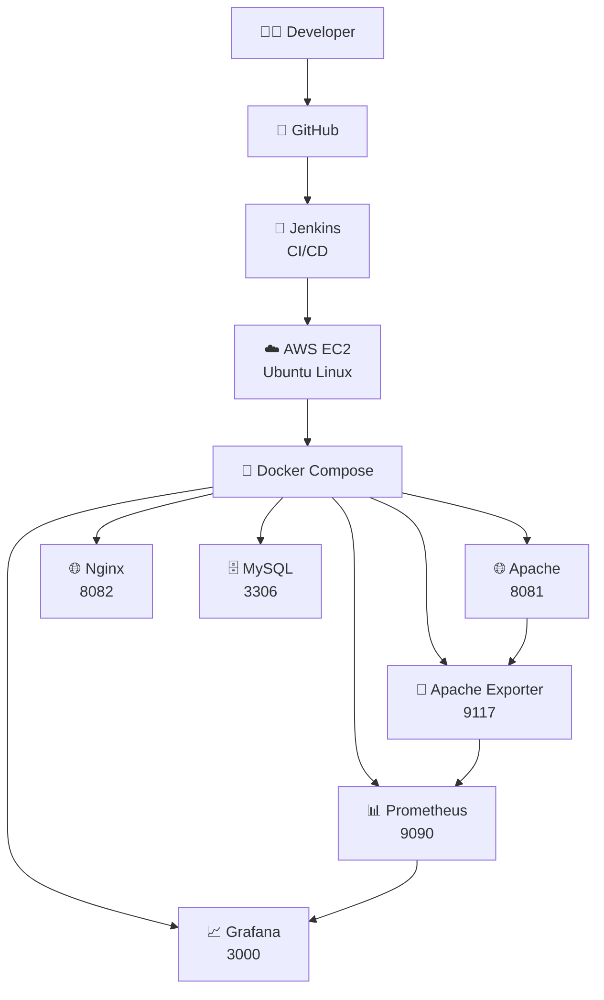
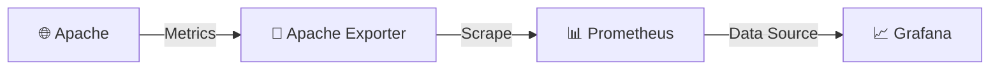
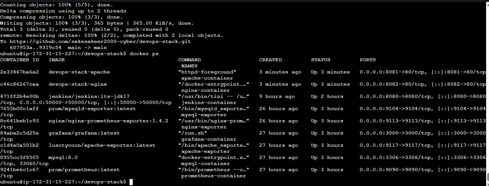
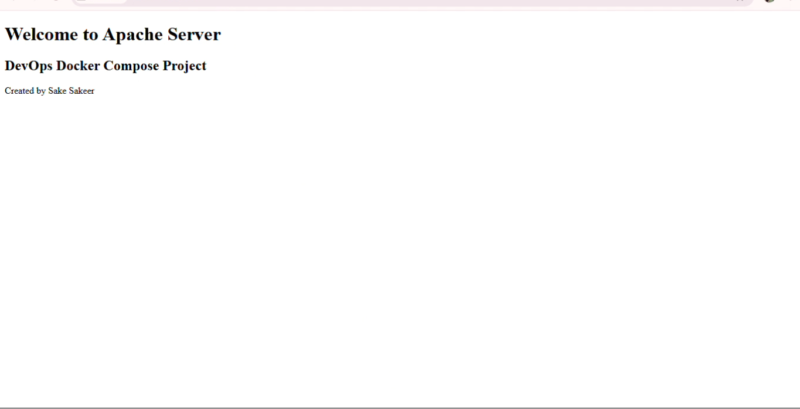
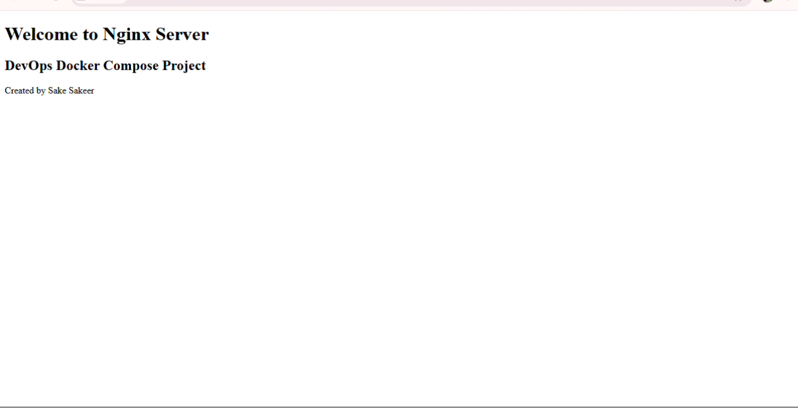
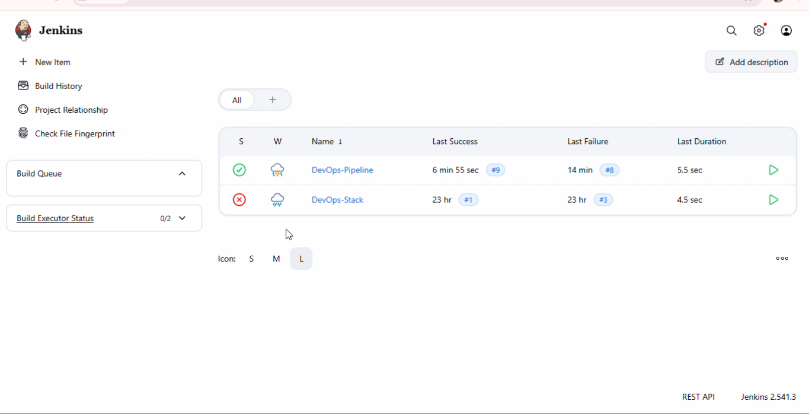
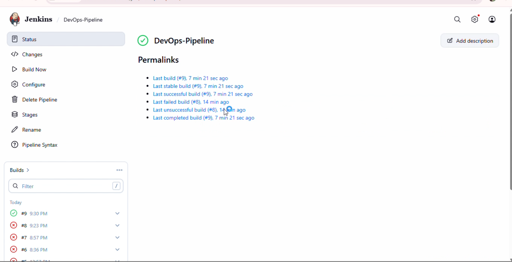
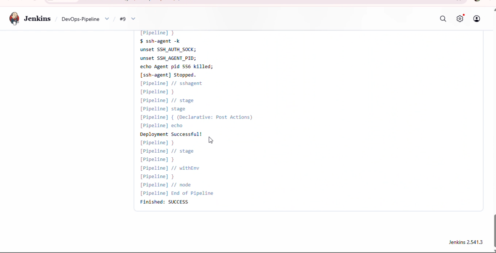

<div align="center">

# 🚀 DevOps CI/CD & Monitoring Platform

### ☁️ AWS EC2 • 🐳 Docker • 🔄 Jenkins • 📊 Prometheus • 📈 Grafana

**A production-style containerized DevOps environment for CI/CD,  
service deployment, monitoring, and infrastructure management.**

<br>


<br><br>

<a href="https://github.com/sakesakeer2000-cyber/devops-stack">

</a>

<a href="https://sakesakeer2000-cyber.github.io/AWS-DevOps-Portfolio/">

</a>

<a href="https://www.linkedin.com/in/sakesakeera/">

</a>

</div>

---

<div align="center">

## ⚡ DEVOPS PIPELINE

**CODE → BUILD → TEST → DEPLOY → CONTAINERIZE → MONITOR → VISUALIZE**

</div>

---

# 🎯 Project Snapshot

<table>
<tr>

<td width="25%" align="center">

### ☁️ CLOUD

**AWS EC2**

Ubuntu Linux

</td>

<td width="25%" align="center">

### 🐳 CONTAINERS

**Docker**

Docker Compose

</td>

<td width="25%" align="center">

### 🔄 AUTOMATION

**Jenkins**

CI/CD Pipeline

</td>

<td width="25%" align="center">

### 📊 OBSERVABILITY

**Prometheus + Grafana**

Monitoring

</td>

</tr>
</table>

---

# 🧠 What Is This Project?

This project is a hands-on **DevOps infrastructure and automation environment**
deployed on an **AWS EC2 Ubuntu server**.

It combines multiple technologies into a single environment to demonstrate
how modern DevOps workflows can be implemented.

### The project covers:

```text
☁️ AWS Infrastructure
        ↓
🐧 Linux Server
        ↓
🐳 Docker Containers
        ↓
📦 Docker Compose
        ↓
🔄 Jenkins CI/CD
        ↓
🌐 Application Services
        ↓
📊 Prometheus
        ↓
📈 Grafana
        ↓
👀 Monitoring & Visualization
```

---

# 🏗️ Complete Architecture



---

# 🔄 CI/CD Pipeline

<div align="center">

```text
┌──────────────┐
│ 👨‍💻  CODE    │
└──────┬───────┘
       ↓
┌──────────────┐
│ 🐙  GITHUB   │
└──────┬───────┘
       ↓
┌──────────────┐
│ 🔄  JENKINS  │
└──────┬───────┘
       ↓
┌──────────────┐
│ 🔨  BUILD    │
└──────┬───────┘
       ↓
┌──────────────┐
│ 🧪  TEST     │
└──────┬───────┘
       ↓
┌──────────────┐
│ 🚀  DEPLOY   │
└──────┬───────┘
       ↓
┌──────────────┐
│ 🐳  DOCKER   │
└──────────────┘
```

</div>

### Pipeline Flow

| # | Stage | Action |
|---|---|---|
| 01 | 🐙 **Source** | Code maintained in GitHub |
| 02 | 🔄 **Trigger** | Jenkins starts pipeline |
| 03 | 🔨 **Build** | Build process executes |
| 04 | 🧪 **Test** | Configured checks execute |
| 05 | 🚀 **Deploy** | Services are deployed |
| 06 | 📊 **Monitor** | Metrics are collected |
| 07 | 📈 **Visualize** | Grafana displays metrics |

---

# 📊 Monitoring Architecture



<div align="center">

### 🌐 Apache
↓  
### 📡 Apache Exporter
↓  
### 📊 Prometheus
↓  
### 📈 Grafana

</div>

---

# 🧩 Infrastructure Components

<table>
<tr>
<th>Component</th>
<th>Technology</th>
<th>Role</th>
</tr>

<tr>
<td>☁️ Cloud</td>
<td><b>AWS EC2</b></td>
<td>Host infrastructure</td>
</tr>

<tr>
<td>🐧 Operating System</td>
<td><b>Ubuntu Linux</b></td>
<td>Server environment</td>
</tr>

<tr>
<td>🐳 Container Engine</td>
<td><b>Docker</b></td>
<td>Containerization</td>
</tr>

<tr>
<td>📦 Container Management</td>
<td><b>Docker Compose</b></td>
<td>Multi-service deployment</td>
</tr>

<tr>
<td>🌐 Web Server</td>
<td><b>Apache</b></td>
<td>Web service</td>
</tr>

<tr>
<td>🌐 Web Server</td>
<td><b>Nginx</b></td>
<td>Web service</td>
</tr>

<tr>
<td>🗄️ Database</td>
<td><b>MySQL</b></td>
<td>Database service</td>
</tr>

<tr>
<td>🔄 CI/CD</td>
<td><b>Jenkins</b></td>
<td>Pipeline automation</td>
</tr>

<tr>
<td>📊 Monitoring</td>
<td><b>Prometheus</b></td>
<td>Metrics collection</td>
</tr>

<tr>
<td>📈 Visualization</td>
<td><b>Grafana</b></td>
<td>Monitoring dashboard</td>
</tr>

<tr>
<td>📡 Metrics</td>
<td><b>Apache Exporter</b></td>
<td>Apache metrics collection</td>
</tr>

</table>

---

# 🔌 Service Map

<div align="center">

| 🧩 Service | 🔌 Port | 🎯 Function |
|:---:|:---:|:---|
| 🌐 Apache | `8081` | Web Server |
| 🌐 Nginx | `8082` | Web Server |
| 🗄️ MySQL | `3306` | Database |
| 📊 Prometheus | `9090` | Metrics |
| 📈 Grafana | `3000` | Dashboard |
| 📡 Apache Exporter | `9117` | Apache Metrics |

</div>

---

# 🖥️ Real Project Implementation

## 🐳 Docker Environment



> Docker Compose manages the multiple services running in the environment.

---

## 🌐 Apache Web Server



> Apache web server deployed as part of the containerized environment.

---

## 🌐 Nginx Web Server



> Nginx web server running alongside the other services.

---

# 🔄 Jenkins CI/CD

## Jenkins Dashboard



---

## Jenkins Pipeline



> Jenkins is used to demonstrate automated CI/CD workflow.

---

## ✅ Successful Pipeline



> Successful pipeline execution.

---

# 📊 Monitoring & Observability

## Prometheus


> Prometheus collects and exposes monitoring metrics.

---

## Grafana


> Grafana provides a visual dashboard for monitoring the environment.

---

# 🛠️ Technology Stack

<div align="center">

### ☁️ Cloud

`AWS EC2`

### 🐧 Operating System

`Ubuntu Linux`

### 🐳 Containerization

`Docker` `Docker Compose`

### 🔄 CI/CD

`Jenkins` `Git` `GitHub`

### 🌐 Web

`Apache` `Nginx`

### 🗄️ Database

`MySQL`

### 📊 Monitoring

`Prometheus` `Apache Exporter`

### 📈 Visualization

`Grafana`

</div>

---

# 📁 Project Structure

```text
devops-stack/
│
├── 📁 apache/
│   └── Dockerfile
│
├── 📁 nginx/
│   ├── Dockerfile
│   └── nginx-status.conf
│
├── 📁 db/
│
├── 📁 prometheus/
│   └── prometheus.yml
│
├── 📁 grafana/
│
├── 📁 jenkins/
│
├── 📁 screenshots/
│   ├── 01-docker-compose-services.png
│   ├── 02-apache-server.png
│   ├── 03-nginx-server.png
│   ├── 04-jenkins-dashboard.png
│   ├── 05-jenkins-pipeline.png
│   ├── 06-jenkins-success.png
│   ├── 07-prometheus.png
│   └── 08-grafana.png
│
├── 📄 Jenkinsfile
├── 📄 docker-compose.yml
├── 📄 .gitignore
└── 📄 README.md
```

---

# 🚀 Deployment

## 1️⃣ Launch AWS EC2

Create an Ubuntu EC2 instance and connect through SSH.

## 2️⃣ Install Docker

Verify Docker installation:

```bash
docker --version
```

## 3️⃣ Verify Docker Compose

```bash
docker compose version
```

## 4️⃣ Clone Repository

```bash
git clone https://github.com/sakesakeer2000-cyber/devops-stack.git
```

## 5️⃣ Enter Project

```bash
cd devops-stack
```

## 6️⃣ Start Environment

```bash
docker compose up -d
```

## 7️⃣ Verify Containers

```bash
docker ps
```

## 8️⃣ Check Services

```bash
docker compose ps
```

---

# 🧰 Useful Commands

```bash
# Start
docker compose up -d

# Stop
docker compose down

# Restart
docker compose restart

# View containers
docker ps

# View services
docker compose ps

# View logs
docker compose logs -f

# Rebuild
docker compose build
```

---

# 🌐 Access the Environment

Replace `<EC2-PUBLIC-IP>` with your EC2 public IP.

```text
🌐 Apache
http://<EC2-PUBLIC-IP>:8081

🌐 Nginx
http://<EC2-PUBLIC-IP>:8082

📊 Prometheus
http://<EC2-PUBLIC-IP>:9090

📈 Grafana
http://<EC2-PUBLIC-IP>:3000

📡 Apache Exporter
http://<EC2-PUBLIC-IP>:9117
```

> 🔐 For security, administrative and monitoring ports should normally be restricted through AWS Security Groups rather than exposed publicly.

---

# 🧠 Skills Demonstrated

<div align="center">

<table>
<tr>
<td align="center">☁️<br><b>AWS</b><br>EC2</td>
<td align="center">🐧<br><b>Linux</b><br>Ubuntu</td>
<td align="center">🐳<br><b>Docker</b><br>Containers</td>
<td align="center">🔄<br><b>Jenkins</b><br>CI/CD</td>
</tr>

<tr>
<td align="center">🌐<br><b>Apache</b><br>Web Server</td>
<td align="center">🌐<br><b>Nginx</b><br>Web Server</td>
<td align="center">🗄️<br><b>MySQL</b><br>Database</td>
<td align="center">📊<br><b>Prometheus</b><br>Monitoring</td>
</tr>

<tr>
<td align="center">📈<br><b>Grafana</b><br>Dashboard</td>
<td align="center">📡<br><b>Exporter</b><br>Metrics</td>
<td align="center">🐙<br><b>Git</b><br>Version Control</td>
<td align="center">☁️<br><b>DevOps</b><br>Automation</td>
</tr>
</table>

</div>

---

# 🎓 Key Learning Outcomes

Through this project, I gained practical experience in:

```text
☁️ AWS EC2
     ↓
🐧 Linux Administration
     ↓
🐳 Docker
     ↓
📦 Docker Compose
     ↓
🔄 Jenkins CI/CD
     ↓
🌐 Web Services
     ↓
📊 Prometheus
     ↓
📈 Grafana
     ↓
🚀 DevOps Automation
```

### Key areas practiced

- ☁️ Cloud infrastructure
- 🐧 Linux server administration
- 🐳 Containerization
- 📦 Multi-container orchestration
- 🔄 CI/CD automation
- 🌐 Web server configuration
- 🗄️ Database services
- 📊 Monitoring
- 📈 Dashboard visualization
- 🔧 Git & GitHub

---

# 🚀 Future Improvements

```text
🔐 HTTPS / SSL
        ↓
🌐 Nginx Reverse Proxy
        ↓
🔄 GitHub Webhooks
        ↓
🚨 Grafana Alerts
        ↓
📡 Additional Exporters
        ↓
🏗️ Terraform
        ↓
🤖 Ansible
        ↓
🔒 Container Security
```

---

# 💼 Why This Project Matters

This project brings several DevOps concepts together in one environment:

| Concept | Demonstrated With |
|---|---|
| ☁️ Cloud Infrastructure | AWS EC2 |
| 🐳 Containerization | Docker |
| 📦 Multi-Service Deployment | Docker Compose |
| 🔄 CI/CD | Jenkins |
| 🌐 Web Services | Apache + Nginx |
| 🗄️ Database | MySQL |
| 📊 Monitoring | Prometheus |
| 📈 Visualization | Grafana |
| 🔧 Version Control | Git + GitHub |

---

<div align="center">

# 👨‍💻 Sake Sakeer

### ☁️ AWS Cloud & DevOps Engineer

`AWS` • `Linux` • `Docker` • `Jenkins` • `CI/CD` • `Prometheus` • `Grafana`

<br>

<a href="https://sakesakeer2000-cyber.github.io/AWS-DevOps-Portfolio/">

</a>

<a href="https://www.linkedin.com/in/sakesakeera/">

</a>

<a href="https://github.com/sakesakeer2000-cyber">

</a>

<br><br>

### ☁️ Build • 🚀 Automate • 📊 Monitor • 🔧 Improve

⭐ **Thanks for visiting this project!**

</div>
